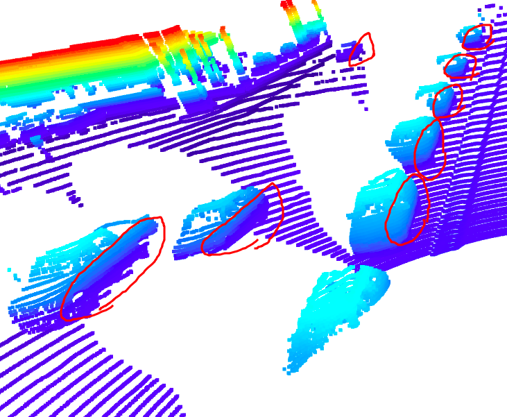

# 3D Object Detection

This projects uses deep learning to detect vehicles in LIDAR data based on a birds-eye view perspective of the 3D point-cloud. 


## Setup

### Installation
Run the following commands to set up project dependencies.

```
# This project requires Python 3.7 or above
conda create --name udacity python=3.7

# Switch to 'udacity' env
conda activate udacity

# Install package requirements
pip3 install -r requirements.txt
```

For Ubuntu User Only:

```
# To fix "Failed to load iris driver" error for Open3D
# It seems to be a conflict between conda and system.
# Refer to https://blog.csdn.net/weixin_45681833/article/details/130453041

# edit ~/.bashrc
export LD_PRELOAD=/usr/lib/x86_64-linux-gnu/libstdc++.so.6
```

### Waymo Open Dataset Reader
The Waymo Open Dataset Reader is a very convenient toolbox that allows you to access sequences from the Waymo Open Dataset without the need of installing all of the heavy-weight dependencies that come along with the official toolbox. 

```
cd tools/waymo_reader
python setup.py install
```

(Please check `tools/waymo_reader/README.md` for more details.)

### Waymo Open Dataset Files

This project makes use of three different sequences to illustrate the concepts of object detection and tracking.
```
Sequence 1 : `training_segment-1005081002024129653_5313_150_5333_150_with_camera_labels.tfrecord`
Sequence 2 : `training_segment-10072231702153043603_5725_000_5745_000_with_camera_labels.tfrecord`
Sequence 3 : `training_segment-10963653239323173269_1924_000_1944_000_with_camera_labels.tfrecord`
```

<br/>

Please follow these steps to download the sequence files.

1. Register with [Waymo Open Dataset](https://waymo.com/open/terms) first, if you have not already, making sure to note "Udacity" as your institution.

2. Once you have done so, please [click here](https://console.cloud.google.com/storage/browser/waymo_open_dataset_v_1_2_0_individual_files) to access the Google Cloud Container that holds all the sequences. Once you have been cleared for access by Waymo (which might take up to 48 hours), you can download the individual sequences. 

3. The sequences listed above can be found in the folder "training". Please download them and put the `tfrecord`-files into the `dataset` folder of this project.

### Pre-Trained Models
The object detection methods used in this project use pre-trained models which have been provided by the original authors. 
They can be downloaded [here](https://drive.google.com/file/d/1Pqx7sShlqKSGmvshTYbNDcUEYyZwfn3A/view?usp=sharing) (darknet) and [here](https://drive.google.com/file/d/1RcEfUIF1pzDZco8PJkZ10OL-wLL2usEj/view?usp=sharing) (fpn_resnet). 
Once downloaded, please copy the model files into the paths `/tools/objdet_models/darknet/pretrained` and `/tools/objdet_models/fpn_resnet/pretrained` respectively.

### Using Pre-Computed Results
In the main file `loop_over_dataset.py`, you can choose which steps of the algorithm should be executed. If you want to call a specific function, you simply need to add the corresponding string literal to one of the following lists: 

- `exec_data` : controls the execution of steps related to sensor data. 
  - `pcl_from_rangeimage` transforms the Waymo Open Data range image into a 3D point-cloud
  - `load_image` returns the image of the front camera

- `exec_detection` : controls which steps of model-based 3D object detection are performed
  - `bev_from_pcl` transforms the point-cloud into a fixed-size birds-eye view perspective
  - `detect_objects` executes the actual detection and returns a set of objects (only vehicles) 
  - `validate_object_labels` decides which ground-truth labels should be considered (e.g. based on difficulty or visibility)
  - `measure_detection_performance` contains methods to evaluate detection performance for a single frame

In case you do not include a specific step into the list, pre-computed binary files will be loaded instead. This enables you to run the algorithm and look at the results even without having implemented anything yet. The pre-computed results for the mid-term project need to be loaded using [this](https://drive.google.com/drive/folders/1-s46dKSrtx8rrNwnObGbly2nO3i4D7r7?usp=sharing) link. Please use the folder `darknet` first. Unzip the file within and put its content into the folder `results`.

- `exec_tracking` : controls the execution of the object tracking algorithm

- `exec_visualization` : controls the visualization of results
  - `show_range_image` displays two LiDAR range image channels (range and intensity)
  - `show_labels_in_image` projects ground-truth boxes into the front camera image
  - `show_objects_and_labels_in_bev` projects detected objects and label boxes into the birds-eye view
  - `show_objects_in_bev_labels_in_camera` displays a stacked view with labels inside the camera image on top and the birds-eye view with detected objects on the bottom
  - `show_tracks` displays the tracking results
  - `show_detection_performance` displays the performance evaluation based on all detected 
  - `make_tracking_movie` renders an output movie of the object tracking results

Even without solving any of the tasks, the project code can be executed. 

The final project uses pre-computed lidar detections in order for all students to have the same input data. If you use the workspace, the data is prepared there already. Otherwise, [download the pre-computed lidar detections](https://drive.google.com/drive/folders/1IkqFGYTF6Fh_d8J3UjQOSNJ2V42UDZpO?usp=sharing) (~1 GB), unzip them and put them in the folder `results`.

## External Dependencies
Parts of this project are based on the following repositories: 
- [Simple Waymo Open Dataset Reader](https://github.com/gdlg/simple-waymo-open-dataset-reader)
- [Super Fast and Accurate 3D Object Detection based on 3D LiDAR Point Clouds](https://github.com/maudzung/SFA3D)
- [Complex-YOLO: Real-time 3D Object Detection on Point Clouds](https://github.com/maudzung/Complex-YOLOv4-Pytorch)

## Write-up
Here are 10 examples of vehicles with varying degrees of visibility in the point cloud.


There are various factors they may affect the appearance of vehicles in the lidar point cloud.
However, some features are shared that can be used to identify vehicle objects.

- Distance to Vehicle
- Direction of Traffic
- Type of Vehicle

Although vehicles far away are smaller while closer ones are bigger.
There are some shared patterns, just in different scale due to the distance, especially if it's from the same direction of traffic.

### Incoming Traffic

Take the incoming traffic as an instance, one thing observed is it would look like two boxes stacked together.
A bigger one is in the bottom and a smaller one is on the top as shown below.


There are some non-reflective surfaces, such as windshield, would appear as empty inside the top box.


In addition, the bottom part of the side along with wheels, also poses a distinguishable pattern.



### Outgoing Traffic
As for outgoing traffic, since it's in the same direction, it would see the back of vehicles.
The bumper along with wheels also shows a unique pattern can be used to identity a vehicle object. 


### Type of Vehicle
Although vehicles in general share features, there are some only applied to different types of cars.
A pickup truck would have the long trunk in the back. A minivan would appear to be higher and wider.
A trailer would show like two objects connected very close.


